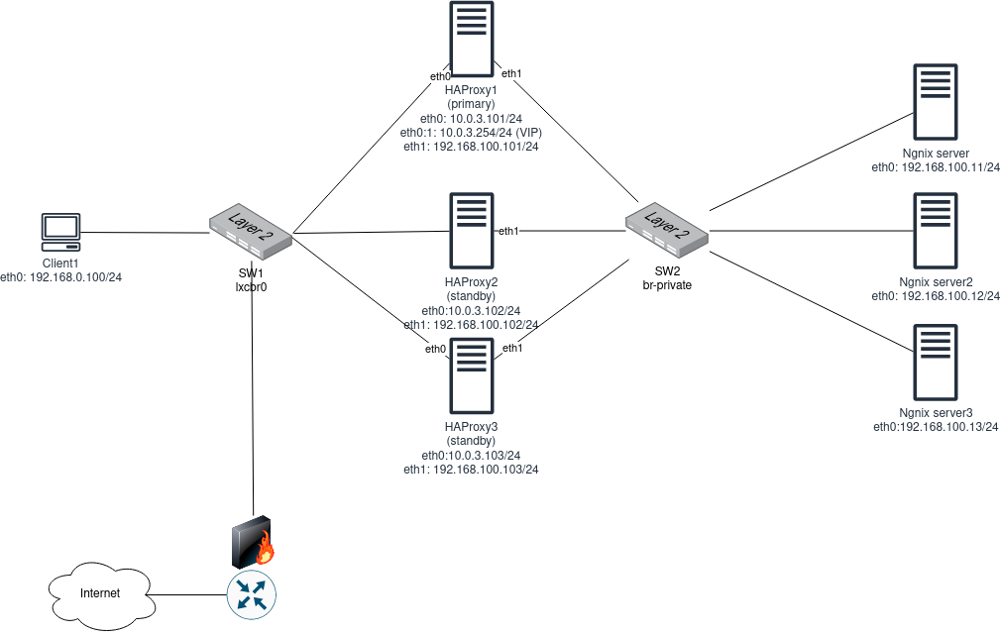

# HAproxy-auto

Configuração de um cenário de HA entre loadbalancers e serviços.

## Cenário de teste



[Link](https://drive.google.com/file/d/1xnbv2z_nI4R5Fh1MX_sGd9gU0LHK9eAb/view?usp=sharing)


* 3 infraestruturas para o load-balancer (HAProxy)
* 3 infraestruturas para o serviço HTTP (Ngnix)

Load-balancer configurado com keepalived para prover alta disponibilidade.

### Infraestrutura

|    Nome    |   Endereço IPv4  |
|:----------:|:----------------:|
|   lxcbr0   |    10.0.3.0/24   |
| br-private | 192.168.100.0/24 |


| Insfraestrutura | eth0                          | eth1                           | eth0:1 (VIP)  |
|:---------------:|:-----------------------------:|:------------------------------:|:-------------:|
| HAProxy1        | lxcbr0: 10.0.3.101/24         | br-private: 192.168.100.101/24 | 10.0.3.254/24 |
| HAproxy2        | lxcbr0: 10.0.3.102/24         | br-private: 192.168.100.102/24 | x             |
| HAProxy3        | lxcbr0: 10.0.3.103/24         | br-private: 192.168.100.103/24 | x             |
| Nginx1          | br-private: 192.168.100.11/24 | x                              | x             |
| Nginx2          | br-private: 192.168.100.12/24 | x                              | x             |
| Nginx3          | br-private: 192.168.100.13/24 | x                              | x             |


## Instalando/configurando o ambiente usando o ansible

**Requisitos:**
* Ansible na máquina provisionadora instalado
* Conexão ssh entre a máquina provisionadora e provisionados
* Acesso sem senha entre máquina provisionadora e provisionados (opcional)

1. Adicionando chaves públicas ao ambiente provisionado:
```sh
$ ssh-copy-id ubuntu@192.168.100.101
```

2. Definindo IPs no arquivo `inventory`

3. Executar o playbook:
```sh
$ ansible-playbook -i inventory -u ubuntu -K configure-environment.yml
```

Digitar a senha do usuário ubuntu (padrão lxc: ubuntu) e esperar o script finalizar a instalação

4. Teste:
```sh
$ curl http://10.0.3.254:80
```